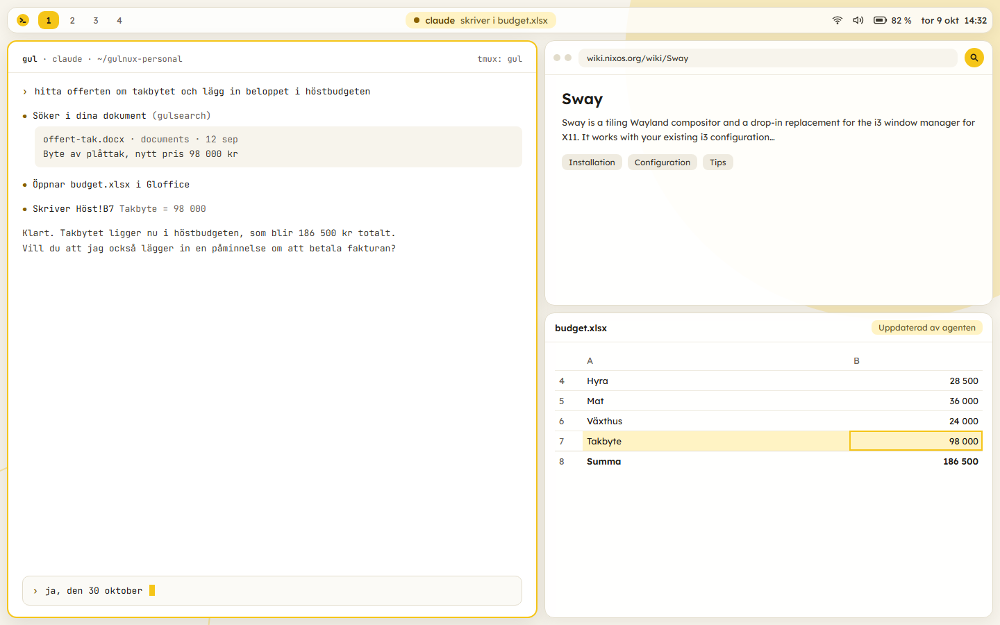
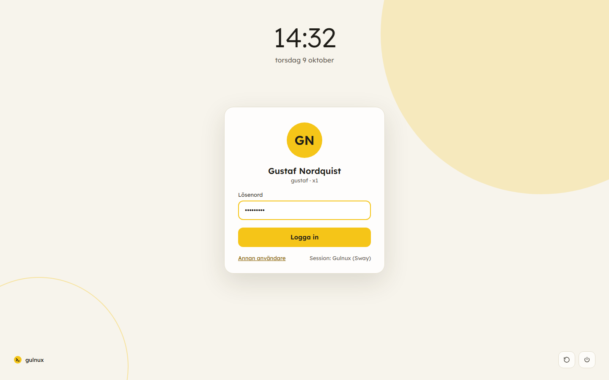
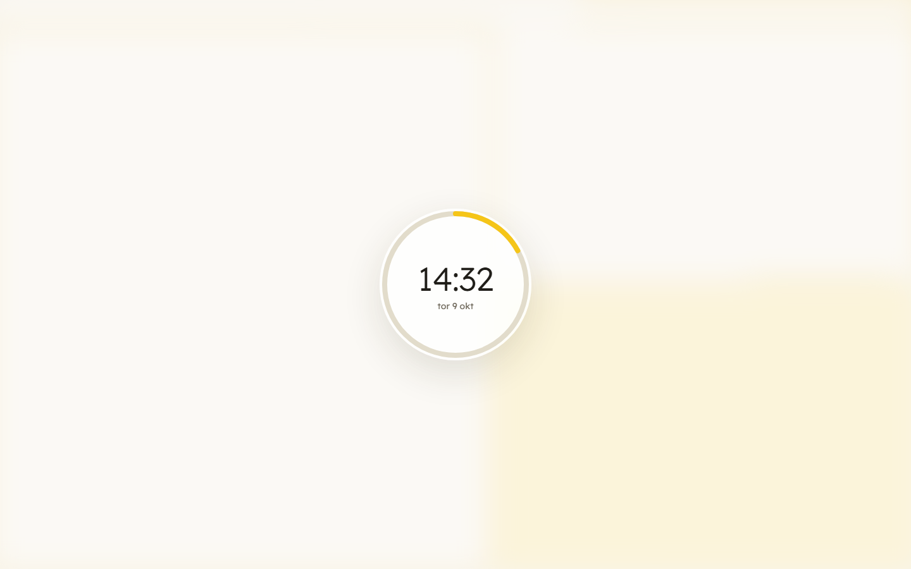
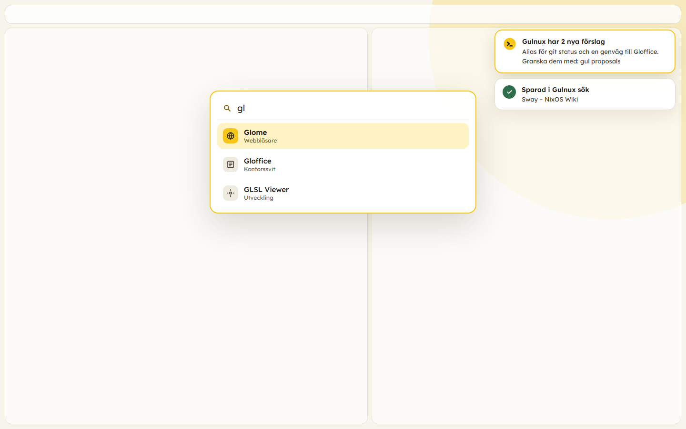
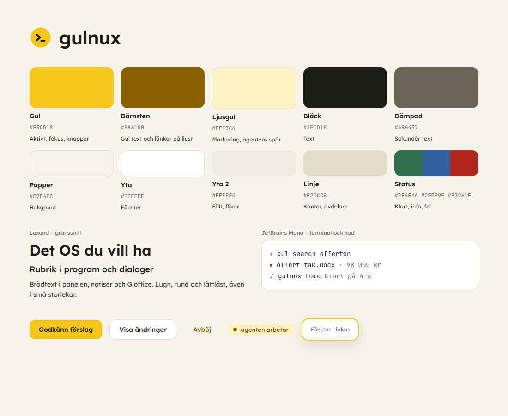
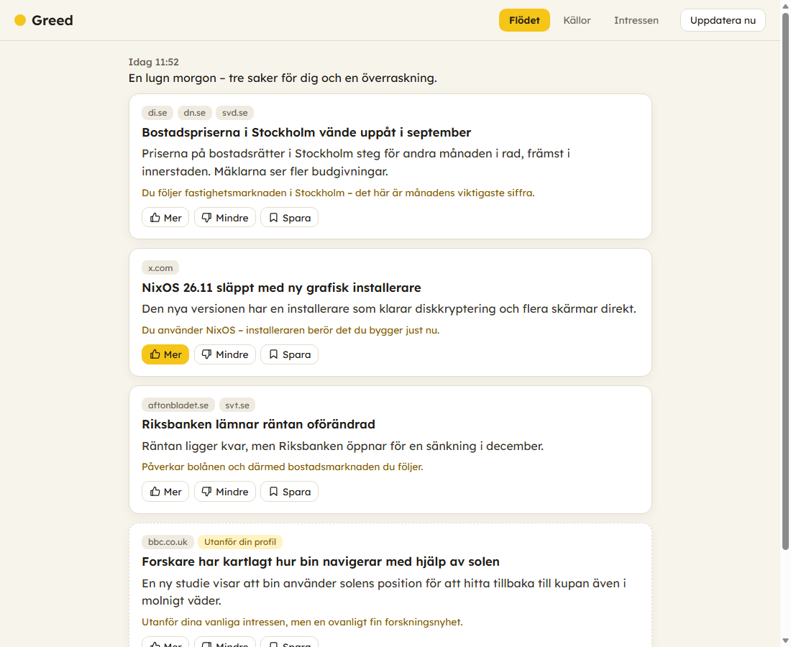
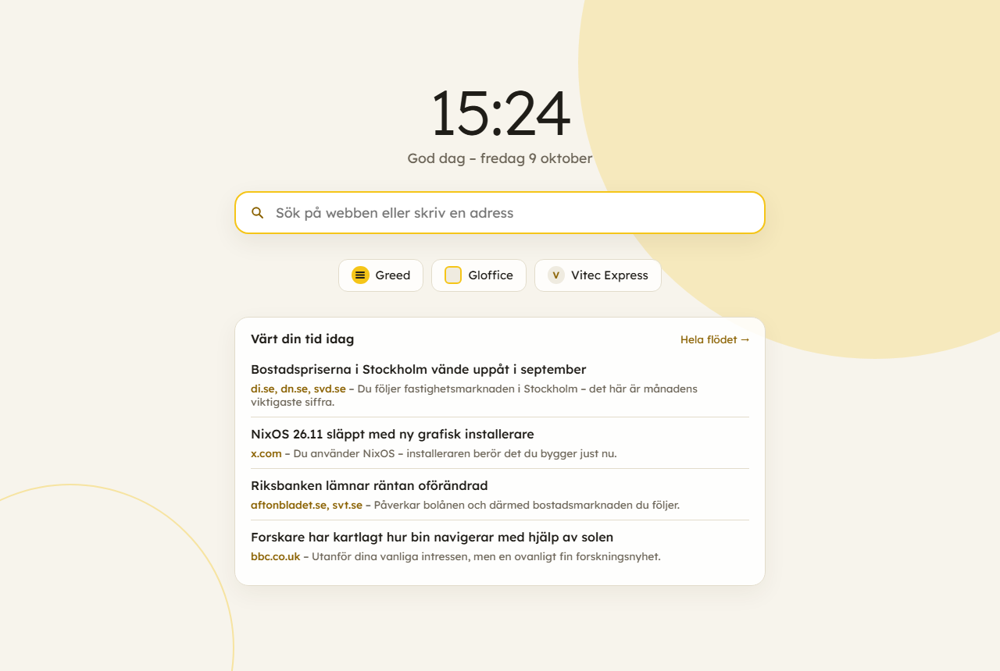
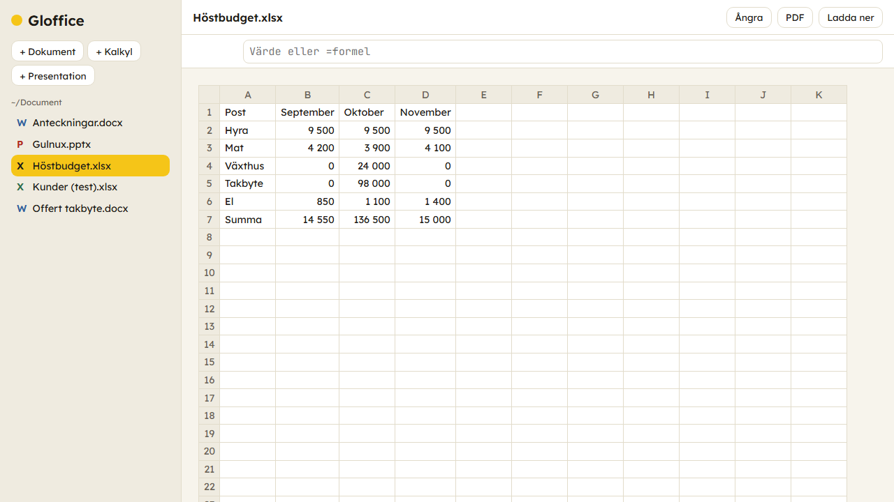
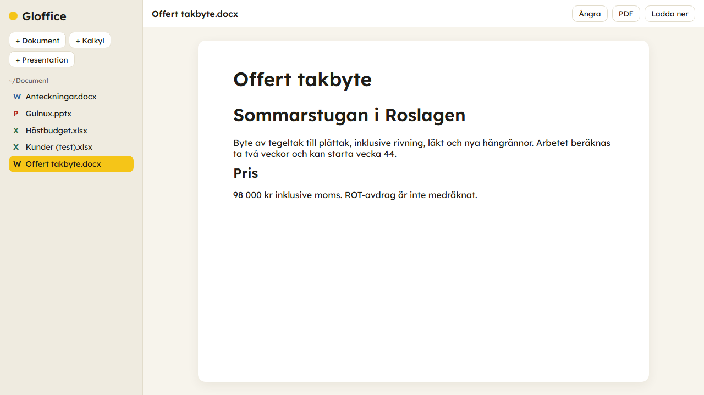
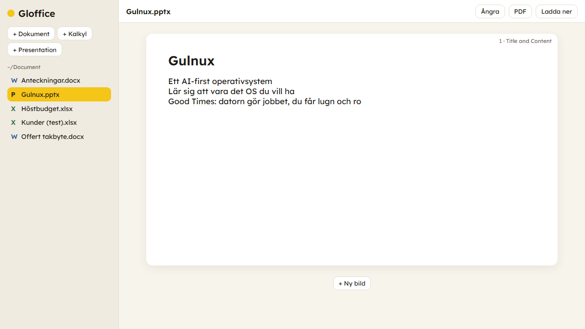

<p align="center">
  
</p>

<h1 align="center">Gulnux</h1>

<p align="center"><b>Ett AI-first-operativsystem som lär sig att vara det OS du vill ha.</b></p>



<p align="center"><sub>Skiss av skrivbordet. Gulnux har ännu inte körts på riktig hårdvara; skisserna byts mot riktiga skärmdumpar efter första installationen.</sub></p>

En AI-first-distribution byggd på NixOS. Startpunkten är en kodagent (Claude Code,
Codex eller Mistral Vibe), och agenten sköter datorn åt dig.

**Ledstjärna: Gulnux ska lära sig att vara det OS som användaren vill ha.**

- **Bas:** NixOS (flake), med rollback av varje ändring
- **Skrivbord:** SwayFX (tiling, Wayland) i ljust tema med gul accent
- **Agent:** `gul` startar vald agent med Gulnux kontext och ditt minne
- **Webbläsare:** Glome, med full MCP-styrning för agenterna
- **Kontorssvit:** Gloffice, med egen MCP-server
- **Sökning:** lokal hybridsökning i dokument, minne och sparade webbsidor
- **Greed:** ett självkurerande flöde – bara det som är värt din tid från nyheter och sociala medier
- **Good Times:** lär datorn dina arbetsuppgifter i webbappar, med verktyg som kan schemaläggas
- **Lärande:** minne, lokal observation och veckovis reflektion med förslag du godkänner

## Utseende

Ljust papper med en solgul accent, rundade hörn och mjuka skuggor.

| | |
|---|---|
|  |  |
| Inloggning (ReGreet, valbar – felsöks) | Låsskärm (swaylock-effects) |
|  |  |
| Programstartare och notiser | Färger och typsnitt |

<sub>Skisser, se ovan.</sub>

| Del | Program |
|---|---|
| Uppstart | Plymouth (tillverkarens logga, ingen rullande text) |
| Inloggning | tuigreet (text) i Gulnux gula färger. Grafiska ReGreet finns som val (`gulnux.desktop.greeter = "regreet";`) men hängde sig på första riktiga installationen och felsöks. |
| Fönster | SwayFX: rundade hörn, skuggor, oskärpa bakom panel och programstartare; gul kant på fönstret i fokus |
| Panel | waybar överst: arbetsytor, **agentens status** (vad den gör just nu), nätverk, ljud, batteri, klocka |
| Terminal, programstartare, notiser | foot, fuzzel och mako med samma palett |
| Låsskärm | swaylock-effects: suddigt skrivbord, ring med klocka |
| Program | adw-gtk3 med gul accent, Papirus-ikoner, Bibata Modern Amber-pekare, Lexend och JetBrains Mono |

Temat sätts per användare och kan ändras i `home.nix`: skriv över en enskild fil med
`xdg.configFile."waybar/style.css".source = lib.mkForce ./min-style.css;` eller stäng av
alltihop med `gulnux.appearance.enable = false;`.

## Två repon: grunden och ditt eget

| Repo | Innehåll | Synlighet |
|---|---|---|
| **Gulnux-grunden** (det här repot) | Själva distributionen. Inget personligt. | Publikt |
| **Ditt personliga repo** (`<ditt-konto>/gulnux-personal`) | Dina inställningar, dina datorer, ditt minne och godkända förslag | Privat |

Ditt personliga repo hämtar grunden som ett beroende med låst version (`gul update`
hämtar senaste). Installationen kräver ett GitHub-konto och skapar repot åt dig. Finns det
redan, till exempel från en tidigare dator, hämtas det, så att hela din Gulnux följer med.

Flera personer kan använda samma dator. Var och en har ett eget personligt repo, och
personliga inställningar ligger på användarnivå (Home Manager), så de kräver inte sudo.
Maskinens ägare lägger till fler användare i sin maskinkonfiguration, och de kör sedan
`gul setup` när de loggar in första gången.

## Lärande

| Del | Vad det gör | Kommando |
|---|---|---|
| **Minne** | Agenterna sparar det de lär sig om dig som korta filer i `memory/` i ditt repo. Alla agenter delar samma minne. | `gul memory` |
| **Observation** | Loggar lokalt vilka program du öppnar och vilka kommandon du kör (bara namnet och om det lyckades, aldrig argument). Sparas i 30 dagar och lämnar aldrig datorn. | `gul log` |
| **Reflektion** | En gång i veckan går en agent igenom loggen, ditt minne och vad du bett agenterna om, och föreslår högst tre förbättringar i en git-gren. Inget ändras utan att du godkänner det. | `gul proposals` |

- Godkänn med `gul proposals accept`, avböj med `gul proposals reject <namn> "varför"`. Avböjda
  förslag sparas i minnet så att de inte föreslås igen.
- Pausa allt med `gul learning off`. Stäng av permanent i `home.nix`:
  `gulnux.learning.observe = false;` och/eller `gulnux.learning.reflect = false;`
- Reflektionen använder din agent och dess konto, så den kostar som en vanlig agentsession.

## Installation

Det här gäller alla installationer. Skillnaden är bara vilken disk du installerar på:
datorns inbyggda disk, ett USB-minne eller en virtuell maskin.

1. **Förbered USB:** ladda ner *NixOS minimal ISO* från nixos.org och skriv den till en
   USB-sticka med Rufus eller balenaEtcher.
2. **BIOS:** stäng av *Secure Boot* (ThinkPad: `F1` vid start) och starta från USB
   (ThinkPad: `F12`).
3. **Nätverk** (wifi; med kabel eller i en VM fungerar det direkt):
   ```
   sudo systemctl start wpa_supplicant
   wpa_cli
   > add_network
   > set_network 0 ssid "NÄTVERK"
   > set_network 0 psk "LÖSENORD"
   > enable_network 0
   > quit
   ```
4. **Hitta disken** du ska installera på:
   ```
   lsblk -o NAME,SIZE,MODEL,TRAN
   ```
   Datorns inbyggda disk heter oftast `nvme0n1`, ett USB-minne `sdb` (med `TRAN = usb`) och
   disken i en VM `sda`.
5. **Partitionera** (raderar hela disken du väljer!). Byt `DISK`, och använd `p1`/`p2` för
   nvme-diskar men `1`/`2` för `sdX`:
   ```
   sudo -i
   DISK=/dev/nvme0n1
   parted $DISK -- mklabel gpt
   parted $DISK -- mkpart ESP fat32 1MB 1GB
   parted $DISK -- set 1 esp on
   parted $DISK -- mkpart root ext4 1GB 100%
   mkfs.fat -F 32 -n BOOT ${DISK}p1
   mkfs.ext4 -L gulnux ${DISK}p2
   mount /dev/disk/by-label/gulnux /mnt
   mount --mkdir -o umask=077 /dev/disk/by-label/BOOT /mnt/boot
   ```
6. **Installera Gulnux:**
   ```
   nix --extra-experimental-features 'nix-command flakes' run --no-write-lock-file github:gustafmaknor/gulnux#install
   ```
   Installationsprogrammet loggar in på GitHub (du får en kod att skriva in på
   github.com/login/device, gärna från mobilen), skapar eller hämtar ditt personliga repo,
   föreslår en maskinprofil (ThinkPad X1 Gen 10, VirtualBox, USB eller generic), installerar
   och frågar efter ditt lösenord.
7. **Starta om**, ta ur USB-stickan och logga in. Agenten startar på arbetsyta 1.

### Testa utan att röra datorns disk

Installera på ett **externt USB-minne eller en USB-SSD** (minst 32 GB, gärna SSD). Du behöver
då en andra USB-sticka med NixOS-ISO:n. Installationsprogrammet känner igen USB-disken och
väljer profilen `usb`, som inte skriver något i datorns bootmeny. Starta Gulnux via `F12`.

Om datorn kör Windows med BitLocker kan avstängd Secure Boot göra att Windows ber om
återställningsnyckeln. Ha den till hands (account.microsoft.com/devices/recoverykey).

### Testa i VirtualBox (Windows)

```
powershell -ExecutionPolicy Bypass -File scripts\vbox-create.ps1
```
Skriptet laddar ner NixOS-ISO:n och skapar och startar VM:en. Följ sedan stegen ovan med
`DISK=/dev/sda` (partitionerna heter då `sda1`/`sda2`).

## Vardag

```
gul                         starta din agent
gul codex                   starta en viss agent
gul search <fråga>          sök i dokument, minne och sparade sidor
gul search save             spara sidan du har framme i Glome
gul memory                  vad Gulnux minns om dig
gul proposals               Gulnux förslag på förbättringar
gul proposals accept|reject godkänn eller avböj ett förslag
gul log                     vad Gulnux har observerat
gul learning off|on         pausa eller slå på lärandet
gul update                  hämta senaste Gulnux-grunden
gul help                    alla kommandon
gulnux-home                 aktivera ändringar i home.nix (användarnivå)
gulnux-rebuild              aktivera ändringar i hosts/ (systemnivå, sudo)
sudo nixos-rebuild switch --rollback   ångra senaste systemändringen
```

## Greed – ditt eget flöde


Vanliga flöden visar det algoritmen vill. Greed samlar hela tiden in från många källor och
visar bara det som är värt din tid – kanske tre, fyra saker om dagen från Aftonbladet i
stället för hela förstasidan.



<sub>Riktig skärmdump av Greed med påhittade exempelposter.</sub>

1. **Samla in brett.** RSS från nyhetssajter (Aftonbladet, DN, SvD, SVT, Expressen, DI, CNN,
   BBC är med från start) och öppna nätverk (YouTube, Reddit, Mastodon, Bluesky). Från
   Facebook, Instagram och X läser Greed de inlägg du **faktiskt scrollar förbi** i Glome.
2. **Sortera grovt lokalt.** Varje post jämförs med dina intressen med den lokala
   språkmodellen. Det kostar inget och sållar bort det mesta.
3. **Låt agenten välja ut** kl 07, 12 och 18. Den får de bästa kandidaterna, väljer det som
   verkligen är intressant, slår ihop samma nyhet från flera källor och skriver *varför*
   just du bör läsa den. Det första urvalet för dagen kommer som en notis.
4. **Bli bättre hela tiden.** Mer/Mindre, vad du öppnar och sparar styr nästa urval, och
   veckoreflektionen föreslår ändringar i dina intressen. En överraskning utanför din profil
   per urval håller flödet från att bli en bubbla.

Dina intressen skriver du med egna ord i `memory/greed.md` (eller säger till agenten), och
källorna ligger i `greed/sources.json` – båda i ditt personliga repo.

| Kommando | |
|---|---|
| `greed` eller `Super+n` | Öppna Greed |
| `greed today` | Dagens urval i terminalen |
| `greed add <rss-adress>` | Lägg till en källa |
| `greed add --gt <app> <verktyg>` | Aktiv läsning av t.ex. Facebook via ett Good Times-verktyg |
| `greed refresh` | Hämta och välj ut nu |

```nix
# home.nix
gulnux.greed.times = [ "06:30" "17:00" ];
gulnux.greed.picks = 5;
```

**Aktiv läsning** (att Greed läser ditt Facebook- eller X-flöde i bakgrunden) är ett val per
källa: lär Good Times sajten och be om ett verktyg som läser flödet, och lägg sedan till det
med `greed add --gt`. Det sker med din inloggning och kan bryta mot sajtens villkor.

## Good Times


Lär datorn de arbetsuppgifter du gör i dina webbappar, så får du good times och lugn och ro.

1. Öppna appen i Glome och logga in som vanligt.
2. Tryck på **solen** (GT-knappen). En agent öppnas i ett eget fönster, frågar vad du brukar
   göra i appen och lär sig det i din inloggade Glome. Den läser och utforskar fritt men
   ändrar inget utan ditt ja.
3. GT skriver anteckningar och bygger **verktyg** för dina uppgifter, och testar dem.
4. Sedan kan du (och alla agenter) be om uppgiften: *"vilka nya intressenter har kommit
   in idag?"*, eller köra den själv: `gt run <app> <verktyg>`. Uppgifter och handlingar kan
   schemaläggas: `gt schedule <app> <verktyg> "Mon..Fri 08:00"` ger en notis med resultatet,
   och *"sänk priset på Exempelgatan 1 till 3,5 miljoner den 30 oktober kl 9"* blir en
   engångshandling som körs på utsatt tid.

| Kommando | |
|---|---|
| `gt` | Appar GT har lärt sig |
| `gt learn [adress]` | Lär GT en app (eller mer om en app den redan kan) |
| `gt tools <app>` | Appens verktyg |
| `gt run <app> <verktyg> ['<json>']` | Kör ett verktyg; `--live` i din Glome, `--yes` för verktyg som ändrar data |
| `gt session <app>` | Kopiera din inloggning från Glome igen |
| `gt schedule <app> <verktyg> <när> ['<json>']` | Schemalägg; `--once` för en engångshandling, `--yes` för handlingar som ändrar data |
| `gt schedule`, `gt unschedule <app> <id>` | Visa och ta bort scheman |

Verktygen kör i en osynlig Chromium med en kopia av din inloggning från Glome, och de
ligger i ditt personliga repo (`gt/<app>/`) så att de följer med till nya datorer.
Inloggningen ligger bara på datorn. Verktyg som ändrar data är märkta och kräver
bekräftelse varje gång.

**Tänk på:** när GT lär sig och använder en app läser agenten det som står på skärmen,
och det skickas till agentens AI-tjänst. Innehåller appen andra personers uppgifter (t.ex.
kunder i ett affärssystem) ska du kontrollera att det är tillåtet enligt arbetsgivarens
och kundernas villkor. Börja gärna med ett testkonto.

## Sökning

Gulnux sök hittar saker i dina dokument (`~/Document`: Word, Excel, PowerPoint, PDF, text),
ditt minne och webbsidor du sparat från Glome. Den kombinerar fulltext, som hittar namn,
nummer och exakta ord, med vektorer från en lokal flerspråkig modell (bge-m3 via ollama),
som hittar på betydelse. Allt stannar på datorn.

- Be agenten: *"hitta offerten om takbyte från i våras"*
- `gul search <fråga>` i terminalen, `gul search status` för att se vad som är indexerat
- Indexet hålls uppdaterat i bakgrunden (`systemctl --user status gulsearch`). Fulltexten
  fungerar direkt, och vektorerna räknas fram i takt med att modellen hinner.

**Webbsidor från Glome** har tre lägen, som du ställer in i `home.nix`:

| `gulnux.search.glome` | Vad som sparas |
|---|---|
| `"off"` | Inga webbsidor |
| `"manual"` (standard) | Bara när du trycker på sökknappen (förstoringsglaset) i Glome eller kör `gul search save` |
| `"auto"` | Varje sida du öppnar, utom undantagna (bank, e-post, vården, myndigheter …). Knappen fungerar även på undantagna sidor. |

```nix
gulnux.search.glome = "auto";
gulnux.search.exclude = [ "bank" "mail." "intranat.foretaget.se" ];
gulnux.search.sources.projekt = "~/Projekt";
```

Ta bort en sida ur indexet med `gul search forget <id>`. Byte mellan `off` och de andra lägena
gäller från nästa gång Glome startar.

## Glome – webbläsaren



<sub>Riktig skärmdump av startsidan med påhittade exempelposter.</sub>

Glome är Chromium i Gulnux färger: verktygsfält och flikar får en ljus gul ton, och
startsidan och nya flikar visar klocka, sökning, genvägar (Greed, Gloffice och appar Good
Times har lärt sig) och det som är **värt din tid idag** från Greed. Sök-, GT- och
Greed-knapparna sitter fast i verktygsfältet.

Glome är Chromium med egen profil (`~/.config/glome`) och fjärrstyrning på `127.0.0.1:9222`.
Agenterna styr den via MCP-servern `glome` (Chrome DevTools MCP), som `gul` registrerar
automatiskt hos Claude Code och Codex.

- Be agenten: *"sök efter NixOS Sway-teman och öppna det bästa i Glome"*
- `/glome` i agenten läser och analyserar sidan du har framme (t.ex. `/glome vilka är för- och nackdelarna?`)
- `glome <url>` öppnar en adress, `glome-read` skriver ut sidans text, `glome-read | claude -p "sammanfatta"`
- `Super+g` öppnar Glome

Fjärrstyrningsporten är bara öppen lokalt, men alla program som körs som din användare kan
styra Glome, inklusive dina inloggade konton.

## Gloffice – kontorssviten



| | |
|---|---|
|  |  |

<sub>Riktiga skärmdumpar av Gloffice.</sub>

En enkel lokal kontorssvit för `.docx`, `.xlsx` och `.pptx`. Den är webbaserad och öppnas som
ett eget fönster i Glome (`gloffice` eller `Super+o`). Agenterna arbetar i filerna via
MCP-servern `gloffice`, och fönstret uppdateras automatiskt medan de gör det.

- Be agenten: *"skapa en budget för hösten i budget.xlsx och öppna den"*
- Textdokument: skriv direkt i stycken, Enter ger nytt stycke
- Kalkylark: klicka i en cell och skriv i formelfältet, `=SUM(A1:A5)` fungerar
- Presentationer: redigera text på bilderna, lägg till bilder
- Allt sparas direkt i originalfilen. Före varje ändring sparas en kopia i
  `~/.local/share/gloffice/backups`, så **Ångra** fungerar även på det agenten gjort.
- PDF-export, äldre format och omräkning av formler görs med LibreOffice.

Begränsningar: bilder och diagram i kalkylark kan försvinna när Gloffice sparar (det beror på
openpyxl). Textdokument redigeras stycke för stycke, och formatering inom ett stycke
förenklas när du ändrar dess text.

## Kortkommandon

| Tangent | Funktion |
|---|---|
| `Super+a` | Hoppa till agenten |
| `Super+Shift+a` | Öppna agentsessionen igen |
| `Super+Enter` | Terminal |
| `Super+g` | Glome |
| `Super+o` | Gloffice |
| `Super+n` | Greed |
| `Super+d` | Programstartare |
| `Super+h/j/k/l` | Flytta fokus |
| `Super+1..9` | Byt arbetsyta |
| `Super+Shift+q` | Stäng fönster |
| `Super+Escape` | Lås skärmen |

## Struktur

```
flake.nix                    moduler, profiler, lib.personal, mall, ISO och install
lib/personal.nix             bygger maskiner och hemkatalog ur ett personligt repo
modules/gulnux/              systemnivå: bas, skrivbord, agenter, Glome, Gloffice, sök
modules/home/                användarnivå: git, observation, reflektion, sök, utseende
modules/profiles/            maskinprofiler: generic, thinkpad-x1-gen10, virtualbox, usb
templates/personal/          mallen för det personliga repot
pkgs/gul.nix                 gul-kommandona
scripts/                     gul, gul-*, gulnux-install, glome, vbox-create
agent/AGENTS.md              kontexten som alla agenter får
agent/prompts/reflect.md     instruktionen till veckoreflektionen
apps/gloffice/               kontorssviten
apps/gulsearch/                 sökningen (index, bakgrundstjänst, MCP)
apps/glome-tillagg/          sökknappen och auto-läget i Glome
apps/gt/                     Good Times (gt, MCP-server, native messaging-värd)
apps/gt-tillagg/             GT-knappen i Glome
apps/greed/                  Greed (insamling, sortering, agentens urval, MCP)
apps/greed-tillagg/          Greed-knappen och läsningen av flöden i Glome
config/                      tema: sway, waybar, foot, fuzzel, mako, swaylock, regreet, logga och bakgrund
hosts/iso/                   installations-ISO
```

## Bygga egen ISO

Kräver Linux med Nix: `nix build .#iso`. ISO:n startar i en terminal med agenterna och
`gulnux-install` förinstallerade.
